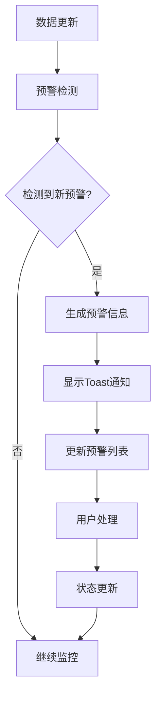

# 智慧城市预警系统使用指南

## 🎯 系统概述

本系统实现了完整的智能预警功能，基于实时数据自动检测城市问题并及时通知相关人员，帮助城市管理者快速响应和处理各类突发事件。

## 🚀 核心功能

### 1. 预警规则
- **聚集性问题预警**: 同一区域1小时内上报≥5次同类事件
- **设施异常预警**: 传感器数值连续3次超阈值
- **智能检测**: 每分钟自动分析数据变化

### 2. 预警展示
- **Toast通知**: 实时弹出预警提示，支持自动消失
- **预警列表**: 集中管理所有预警信息
- **分级管理**: 高/中/低三级预警分类

### 3. 处理流程
- **状态管理**: 待处理 → 处理中 → 已解决
- **AI建议**: 自动生成专业的处置建议
- **地图定位**: 支持查看预警发生位置

## 📋 预警类型

### 聚集性问题预警
- **触发条件**: 同一区域1小时内上报≥5次同类事件
- **监控对象**: 城市事件（道路积水、路灯故障等）
- **预警级别**: 根据事件数量动态评估
  - 10+ 次: 高级预警
  - 7-9 次: 中级预警
  - 5-6 次: 低级预警

### 设施异常预警
- **触发条件**: 传感器连续3次检测到异常数值
- **监控对象**: 各类传感器（积水监测、噪音、空气质量等）
- **预警级别**: 基于超标程度动态评估
  - 超标≥3倍: 高级预警
  - 超标≥2倍: 中级预警
  - 超标<2倍: 低级预警

## 🎨 用户界面

### 预警Toast通知
- **实时显示**: 预警发生后立即弹出
- **视觉层次**: 红色（高级）→ 橙色（中级）→ 绿色（低级）
- **交互功能**: 点击查看详情或稍后处理
- **自动消失**: 高级10秒、中级15秒、低级20秒

### 预警中心页面
- **统计概览**: 实时显示预警总数和分类统计
- **智能筛选**: 支持按类型、状态、级别筛选
- **详细信息**: 包含问题描述、AI建议、地理位置等
- **批量操作**: 支持状态更新和批量处理

## ⚙️ 系统配置

### 检测周期
- **自动检测**: 每1分钟执行一次
- **智能防重**: 5分钟内不重复相同预警
- **模拟演示**: 无真实预警时生成模拟数据

### 数据源
- **事件数据**: 城市民众上报的事件信息
- **传感器数据**: 各类物联网监测设备数据
- **实时更新**: 数据变化立即检测

## 🔄 工作流程



## 📊 预警统计

### 实时统计指标
- **预警总数**: 当前系统中的预警数量
- **状态分布**: 待处理/处理中/已解决数量
- **类型分布**: 聚集性/设施异常数量
- **级别分布**: 高/中/低级预警数量

### 历史数据分析
- **趋势分析**: 预警发生频率和类型趋势
- **热点区域**: 预警高发区域识别
- **响应效率**: 处理时间分布和效率评估

## 🛠️ 技术实现

### 核心服务架构
```typescript
// 数据存储服务
alertService: {
  getAlerts(),           // 获取预警列表
  addAlert(),           // 添加新预警
  updateAlertStatus(),   // 更新预警状态
  getStatistics()       // 获取统计信息
}

// 预警检测引擎
alertDetector: {
  detectAlerts(),       // 执行预警检测
  detectClusterAlerts(), // 检测聚集性问题
  detectAbnormalAlerts() // 检测设施异常
}

// 定时调度器
alertScheduler: {
  start(),              // 启动定时检测
  stop(),               // 停止定时检测
  triggerManualCheck()   // 手动触发检测
}
```

### 数据流程
1. **数据获取**: 从Pinia Store获取最新事件和传感器数据
2. **规则分析**: 应用预警规则进行智能分析
3. **预警生成**: 生成符合格式的预警信息
4. **存储管理**: 保存到localStorage供历史查询
5. **通知推送**: 通过Toast组件实时通知用户

## 🎯 使用指南

### 查看预警
1. 应用启动后系统自动开始预警检测
2. 新预警会以Toast形式弹出通知
3. 点击Toast或访问"预警中心"查看详情
4. 在预警列表中可查看所有历史预警

### 处理预警
1. **待处理**: 点击"开始处理"按钮进入处理状态
2. **处理中**: 执行相应的处理措施
3. **已解决**: 问题解决后标记为"已解决"

### 筛选管理
- **类型筛选**: 聚集性问题 / 设施异常
- **状态筛选**: 待处理 / 处理中 / 已解决
- **级别筛选**: 高级 / 中级 / 低级
- **组合筛选**: 支持多条件组合筛选

## 🔧 高级功能

### AI智能建议
- **问题归因**: 深度分析问题产生原因
- **处置方案**: 提供专业解决方案
- **优先级评估**: 智能评估处理紧急程度
- **资源调配**: 推荐合适的应急资源

### 地图集成
- **位置定位**: 精确显示预警发生地点
- **热力图**: 展示预警高发区域
- **路径规划**: 优化应急响应路线
- **多屏联动**: 与大屏系统集成

### 通知扩展
- **系统通知**: 操作系统原生通知
- **短信通知**: 关键预警短信提醒
- **邮件通知**: 预警详情邮件发送
- **移动推送**: 手机APP实时推送

## 📱 移动端适配

### 响应式设计
- **Toast通知**: 适配移动端屏幕尺寸
- **列表布局**: 触摸友好的列表项设计
- **操作按钮**: 移动端优化的按钮尺寸
- **分页控件**: 适配触摸操作

### 性能优化
- **懒加载**: 大数据集分页加载
- **缓存策略**: 本地存储优化访问速度
- **内存管理**: 自动清理过期数据
- **网络优化**: 智能网络请求管理

## 🔍 故障排除

### 常见问题

1. **预警不显示**
   - 检查是否有充足的事件或传感器数据
   - 确认预警定时任务是否正常运行
   - 查看浏览器控制台错误信息

2. **Toast通知不弹出**
   - 检查浏览器通知权限
   - 确认Toast组件是否正确加载
   - 验证预警数据格式是否正确

3. **预警列表为空**
   - 等待2分钟让系统完成初始化
   - 手动刷新页面重新加载数据
   - 检查数据存储是否正常

### 调试技巧
- 打开浏览器开发者工具查看Console日志
- 检查Application → Local Storage中的预警数据
- 使用Network面板监控API请求
- 观察定时器执行状态

## 🚀 系统扩展

### 新增预警规则
1. 在 `alertDetector` 中添加新的检测逻辑
2. 在 `types/index.ts` 中定义新的预警类型
3. 在 `AlertToast` 组件中添加对应的样式
4. 更新统计信息和筛选选项

### 集成外部系统
- **通知服务**: 集成短信、邮件通知
- **地图服务**: 集成GIS地图系统
- **工作流**: 集成工单管理系统
- **报表系统**: 生成预警统计分析报告

---

## 🎉 总结

智慧城市预警系统通过智能化的实时监控和自动预警，帮助城市管理者及时发现和处理各类问题，提升城市管理效率和响应速度。系统具备完整的预警流程、丰富的交互功能和友好的用户界面，是智慧城市管理平台的重要组成部分。